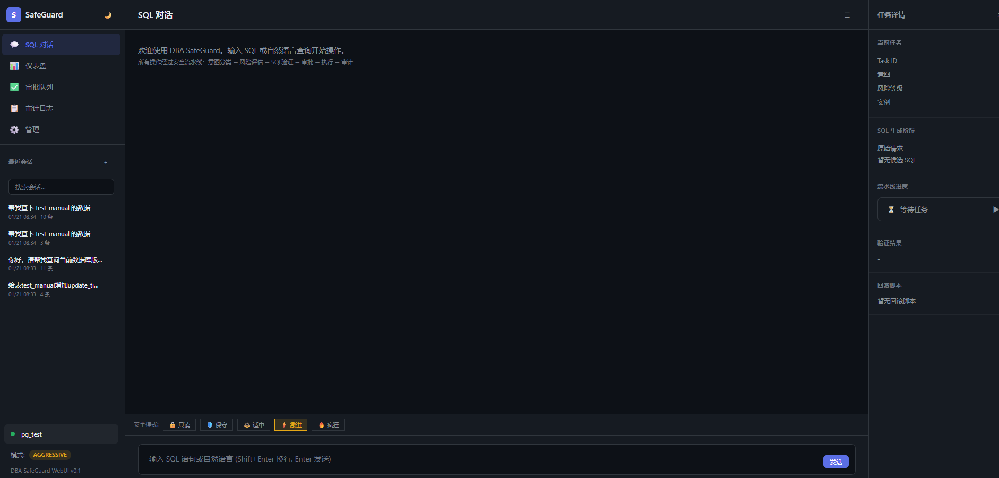
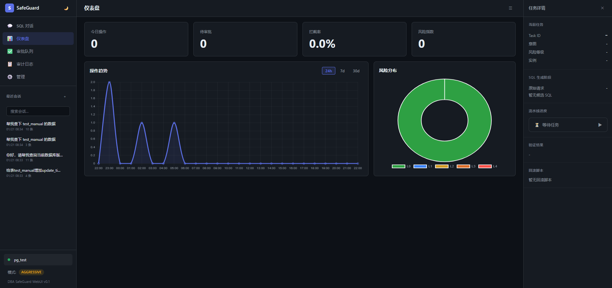
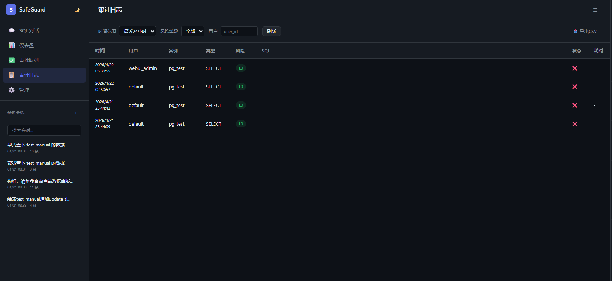
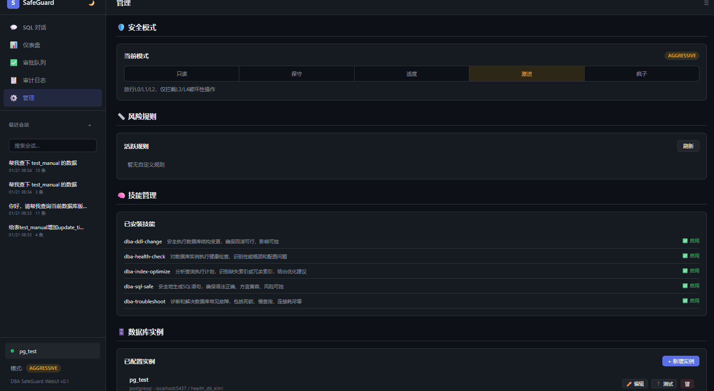
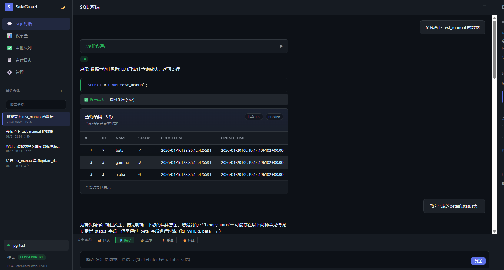

# DBclaw

DBclaw 是一个基于 Hermes 架构演化而来的数据库专家系统，面向 DBA、数据开发、数据治理和企业数据库运维场景。

DBclaw 的核心卖点，不是“让 LLM 直接写 SQL”，而是先把多类数据库的官方/规范说明文档、方言知识和运行上下文汇聚成可检索基准，再由 LLM 在这些基准之上生成候选 SQL，并继续进入安全流水线。也就是说，模型不是在“裸奔生成 SQL”，而是在“带文档基线、带方言约束、带风险边界”地生成 SQL。当前仓库已经接入了一部分数据库文档知识，后续还会继续补充更多数据库语法与运维说明文档。

DBclaw 不是对上游 Hermes 的简单换皮，而是在 Hermes Core 的插件机制、Agent Loop、记忆体系、工具注册体系和多模型兼容层之上，面向数据库场景做的垂直化重构。它的目标很明确：把通用智能体变成一个可审计、可回滚、可持续学习、能真正进入企业数据库运维流程的数据专家。

当前仓库已经包含：

- 基于 Hermes 插件系统实现的 DBA SafeGuard 插件
- 面向数据库操作的闭环安全流水线
- WebUI、CLI、审计、审批、记忆、技能、RAG 文档检索等完整能力
- 面向 SQL 查询结果的聊天内表格展示与分页预览体验

## 界面预览

### SQL 对话封面



### 仪表盘封面



### 审计日志



### 配置管理



### 查看数据库数据示例



## 项目定位

DBclaw 解决的是通用大模型在企业数据库场景里的三个核心问题：

1. 不可信：只给结论，不给链路，无法审计，也无法解释为什么这么做。
2. 不安全：SQL 幻觉、语法错误、误删误改、全表扫描等问题会直接放大为生产事故。
3. 不会积累：每次对话都像第一次接触业务，无法沉淀企业自己的数据库知识和运维经验。

因此，这个项目的设计原则不是“让模型更自由”，而是“让数据库操作更可控”：

- 先理解意图，再决定走 SQL 流水线还是通用问答
- 自然语言请求先生成候选 SQL，再进入现有安全 pipeline
- 所有数据库操作经过预检、校验、风险评估、审批、执行、审计闭环
- 经验沉淀进多层记忆与技能体系，而不是只停留在聊天记录里

## 来源与基线说明

DBclaw 基于 Hermes 的 MIT 开源代码与工程化架构继续演化而来，当前仓库保留了 Hermes 的若干基础模块、目录结构与兼容层实现，并在此基础上新增 DBA SafeGuard 插件、数据库安全流水线、文档增强 SQL 生成和专用 WebUI。

为了避免版本历史混淆：

- 本仓库的公开版本线从 `v0.1.0` 开始计算
- 根目录旧的 `RELEASE_v0.2.0` 到 `RELEASE_v0.9.0` 已归档为上游基线说明
- 仓库内正式变更记录统一写入 [CHANGELOG.md](CHANGELOG.md)

## 基于 Hermes Agent 的继承能力

这个仓库继承并复用了 Hermes Agent 的以下基础能力：

- Agent Loop：多阶段对话与工具调用主循环
- Plugin System：通过 `register(ctx)` 注册工具、Hook、CLI 子命令，而不是修改核心源码
- Tool / Toolset 架构：统一注册数据库工具、审计工具、知识库工具与执行工具
- Hook 生命周期：`pre_tool_call`、`post_tool_call`、`pre_llm_call`、会话开始/结束钩子
- 多模型兼容层：兼容 OpenAI 风格接口，可接入不同模型提供商
- 记忆体系：基于 Hermes 的分层记忆思路扩展为 DBA 领域记忆中枢
- CLI 基座：通过 `hermes dba` 暴露数据库专属运维命令
- WebUI / Gateway 基础：在此基础上扩展成 DBA 专用前后端交互界面

对应的插件接入方式可见 [__init__.py](.hermes/plugins/dba-safeguard/__init__.py)。插件说明中已经明确写出：这是“基于 Hermes Agent Plugin 系统实现，不修改 Hermes 核心源码”的垂直领域扩展。

## 本项目新增的核心能力

### 1. DBA SafeGuard 插件

插件元数据位于 [plugin.yaml](.hermes/plugins/dba-safeguard/plugin.yaml)。当前插件声明提供：

- 12 个工具
- 5 个 Hook
- 面向数据库场景的安全执行、校验、审计、记忆和文档增强能力

工具包括：

- 数据库连接与断开
- SQL AST 校验
- EXPLAIN / 执行计划分析
- 元数据读取
- 回滚脚本生成
- 安全执行
- 审计查询
- 知识库检索
- DBA 记忆检索与保存
- 业务图谱查询

### 2. 闭环数据库执行流水线

数据库任务不是“模型直接输出 SQL 然后执行”，而是走一条有明确阶段边界的流水线。当前实现里，核心阶段包括：

1. 意图分类
2. 任务预检
3. SQL 校验
4. 双重校验
5. 风险评估
6. 回滚脚本生成
7. 审批
8. 执行
9. 审计

这意味着一个数据库请求会先被判断是什么类型的任务，再决定是否需要元数据、是否需要审批、是否能自动通过、是否必须生成回滚脚本，最后才会真正进入执行阶段。

### 3. 自然语言先生成 SQL，再进入 pipeline

这是当前 WebUI 和交互层非常关键的一条行为规则：

- 如果用户输入的是自然语言数据库需求，系统会先做意图分类
- 对查询、DML、DDL 等数据库意图，先调用 LLM 生成候选 SQL
- 对写操作或不确定的语句，默认要求确认
- 用户确认后，候选 SQL 才进入 DBA 安全流水线执行

这个行为在 [dba_bridge.py](webui/dba_bridge.py) 中已经落地：

- 数据库意图会优先走 SQL 生成逻辑
- 查询类任务在满足条件时可直接继续执行
- 写操作和高风险动作会保留确认和审批门槛

### 4. L0-L4 风险分级与五档安全模式

项目将数据库操作划分为 L0-L4 风险等级，并基于风险等级和当前安全模式决定是否自动通过、需要确认、需要审批或直接阻断。

风险等级大致可理解为：

- L0：只读与无损诊断
- L1：低风险写操作
- L2：中风险结构或批量变更
- L3：高风险结构破坏或重度影响操作
- L4：灾难级操作

同时系统提供五档人机协同模式，并且每一档模式对应的可操作边界是明确的：

- 只读审计：只允许只读查询、元数据读取、健康检查、执行计划分析、文档检索和诊断类操作；不允许任何 DML、DDL、回滚执行或结构变更。
- 极度保守：默认仅自动放行 L0 级只读与无损诊断；涉及写入、结构调整、批量变更的操作全部需要更高等级人工确认或审批，不允许直接越过安全关卡执行。
- 适度：可自动通过 L0/L1 级任务，适合日常查询、有限度低风险变更和常规运维；L2 及以上操作进入明确的确认/审批链路。
- 激进：面向测试环境、压测环境或受控维护窗口，可放宽到执行更高风险的 DML/部分 DDL，但仍保留对 L3/L4 高破坏性操作的拦截、确认或审批门槛。
- 疯子模式：最高权限模式，理论上允许覆盖 L0-L4 全部类型操作，包括高风险写入、结构破坏和灾难级动作；仅适合受控实验环境或人工兜底非常强的场景，不建议用于生产。

如果换成更接近执行面的理解，可以概括为：

- 只读审计：只能“看”和“分析”。
- 极度保守：能做少量低风险动作，但写操作默认不过闸。
- 适度：能做日常生产支持，但中高风险动作必须进入审批链。
- 激进：能做较大范围的运维与变更，但仍不是无限制执行。
- 疯子模式：几乎不再设执行边界，风险完全由操作者承担。

这让同一套系统既可以用于生产环境的严控场景，也可以用于测试环境的高效率场景。

### 5. SQL 双层校验与性能拦截

为了防止模型幻觉或错误 SQL 直接进入数据库，项目实现了双重校验：

- 第一层：基于 `sqlglot` 的 AST / 语法与方言校验
- 第二层：基于 EXPLAIN 的执行计划分析与性能风险识别

典型会识别的问题包括：

- 语法不合法
- 方言不兼容
- `UPDATE/DELETE` 无 `WHERE`
- 全表扫描
- 低效索引使用
- 潜在高代价批量操作

只有通过这些校验，任务才会继续进入后续审批与执行阶段。

### 6. 回滚脚本自动生成

对可回滚的数据库操作，系统会尝试生成对应回滚脚本，并把回滚能力作为执行闭环的一部分。

当前支持的典型场景包括：

- `INSERT` -> 精确 `DELETE`
- 结构变更 -> 对应逆向 `ALTER`
- 基于元数据和快照恢复变更前状态

这让“执行完成”不再是终点，而是“可撤销、可恢复”的一部分。

### 7. 审计与审批闭环

所有敏感数据库操作都可以被纳入审计和审批流程。当前仓库已包含：

- 审批请求列表与状态流转
- 审计日志查询与 CSV 导出
- WebUI 审批面板
- 聊天流中的审批提示与结果反馈

项目的重点不是把审批做成单独页面，而是把审批变成数据库执行链路中的天然关卡。

### 8. 四层 DBA 记忆中枢

项目把 Hermes 的记忆能力进一步扩展为数据库专用多层记忆：

- L1：当前工作区与当前任务的临时上下文
- L2：会话历史与可检索的数据库交互记录
- L3：运维经验、成功范式、失败修复经验的沉淀
- L4：业务图谱、业务字段映射、用户习惯与规则模型

这意味着系统不只是“能答题”，而是会逐渐形成企业自己的数据库操作知识体系。

### 9. DBA 技能系统

项目复用了 Hermes 的技能机制，并将其垂直化到 DBA 场景。当前仓库已经内置多种数据库技能和工作流，例如：

- SQL 安全生成
- DDL 变更工作流
- 健康检查
- 索引优化
- 故障排查

这些技能既可以作为固定工作流使用，也可以作为后续经验沉淀和自进化的基础。

### 10. 官方文档 RAG 与数据库知识增强

系统支持数据库文档库检索，并在 SQL 生成、解释和优化时注入对应文档上下文。

它的目标不是做一个通用搜索框，而是让模型在生成数据库操作方案时，尽量以目标数据库方言和知识库为准，减少“看起来像对、实际不可执行”的回答。

### 11. WebUI：可视化数据库专家工作台

当前仓库包含一个完整的 DBA WebUI，入口位于 [server.py](webui/server.py)。

WebUI 不只是聊天框，它已经实现了：

- SQL / 自然语言对话
- 审批列表
- 审计日志
- 仪表盘
- 管理面板
- 数据库实例管理
- LLM 配置管理
- SSE 实时事件更新
- 右侧上下文面板展示任务详情、流水线阶段和回滚脚本

### 12. 查询结果表格预览与增量加载

这是当前仓库相较于传统“只返回一段文本摘要”的一个重要增强点。

对于 `SELECT` 查询，WebUI 现在支持：

- 首次响应默认只返回前 100 行
- 在聊天消息内直接渲染数据表格，而不是只说“影响 0 行”或“返回若干行”
- 当结果集仍有后续数据时，滚动到底部自动继续加载下一批 100 行
- 历史会话回放只显示预览快照，不会重新执行 SQL
- 后续加载来自任务结果缓存，而不是重复执行查询

这样既控制了大结果集的性能风险，也让查询结果真正可读、可浏览。

## 仓库结构

如果你是第一次进入这个仓库，建议优先从下面几个目录开始理解项目：

```text
.hermes/plugins/dba-safeguard/
├── __init__.py                 # 插件注册入口
├── plugin.yaml                 # 插件元数据
├── cli.py                      # hermes dba 子命令
├── config/                     # 数据库与安全配置
├── harnesses/                  # 风险矩阵、意图分类、工作流规范
├── memory/                     # DBA 多层记忆实现
├── skills/                     # DBA 技能文件
└── tools/                      # 连接、校验、执行、审计、RAG 等工具

webui/
├── server.py                   # WebUI 启动入口
├── dba_routes.py               # API 路由层
├── dba_bridge.py               # WebUI 与插件桥接层
├── chat_store.py               # 会话持久化
├── static/js/                  # 前端状态、SSE、聊天与面板逻辑
└── templates/index.html        # 页面入口

tests/                          # 自动化测试主目录
library/                        # 多数据库文档 / RAG 知识库
```

阅读顺序建议如下：

1. 先看插件目录，理解 DBclaw 如何在 Hermes 架构上落地数据库能力。
2. 再看 webui 目录，理解请求是如何从前端进入桥接层和安全流水线的。
3. 最后看 tests 和 library，理解系统的验证范围以及文档增强基础。

## 快速开始

下面给出一条面向本仓库首版发布的最小安装与启动路径，按顺序执行即可完成本地启动。

### 1. 准备 Python 环境

建议在项目根目录创建并启用 Python 虚拟环境，再安装项目依赖。

Windows PowerShell 示例：

```powershell
python -m venv .venv
.\.venv\Scripts\Activate.ps1
pip install -e .
```

Linux/macOS Bash 示例：

```bash
python3 -m venv .venv
source .venv/bin/activate
pip install -e .
```
如果本机 python 已指向 Python 3，也可以用 python

如果你更习惯使用 `requirements.txt`，也可以执行：

```powershell
pip install -r requirements.txt
```

Linux/macOS 下对应命令相同：

```bash
pip install -r requirements.txt
```

如果你已经有现成的项目解释器，也可以直接复用，不强制重新创建环境。

数据库依赖策略已经调整为：

- 基础安装默认包含 WebUI 数据库配置页所需的核心依赖，以及 PostgreSQL / MySQL 驱动
- Oracle、SQL Server、Hive 保持按需安装，避免系统级驱动阻断基础部署

按需扩展安装命令：

```powershell
# Oracle
pip install -e ".[dba-oracle]"

# SQL Server
pip install -e ".[dba-sqlserver]"

# Hive
pip install -e ".[dba-hive]"
```

详细的跨数据库安装说明见 [docs/database-support.md](docs/database-support.md)。

### 2. 启用项目插件

启动前建议至少设置以下环境变量：

```powershell
$env:HERMES_ENABLE_PROJECT_PLUGINS = "true"
$env:DBA_SAFEGUARD_ENABLED = "true"
```

如果是长期开发或部署使用，建议写入启动脚本、`.env` 或系统环境变量，而不是每次手动设置。

### 3. 配置数据库实例

数据库实例配置文件位于：

- `.hermes/plugins/dba-safeguard/config/dba_config.yaml`

这里定义实例名称、数据库类型、连接地址、只读账号、管理员账号以及模型配置等关键参数。

如果你更希望通过界面操作，也可以在 WebUI 的管理面板中直接新增和编辑数据库实例；适合本地验证、演示环境和日常调试场景。

推荐做法：

- 在配置文件中只保留 `*_env` 形式的凭据引用
- 把数据库账号密码放进环境变量，而不是直接写进 YAML

### 4. 配置 LLM

WebUI 使用的模型配置同样从 DBA 配置中读取，相关逻辑位于 [llm_client.py](webui/llm_client.py)。

当前配置的关键项包括：

- `provider`
- `model_name`
- `base_url`
- `api_key_env`

除了直接修改配置文件外，也可以在 WebUI 的管理面板中新增或修改 LLM 配置；前端界面更适合做首版部署验证和快速联调。

设置好模型配置后，还需要把对应 API Key 放入环境变量，系统才会真正启用 SQL 生成与知识增强能力。

### 5. 启动 WebUI

推荐在项目根目录执行以下任一命令：

```powershell
cd webui
python server.py
```

Linux/macOS 下推荐：

```bash
cd webui
python3 server.py
```

或者在项目根目录直接执行：

```powershell
python -B webui/server.py
```

Linux/macOS 下也可以直接执行：

```bash
python3 -B webui/server.py
```

默认启动后访问：

- `http://127.0.0.1:8787`

如果只是验证首版公开仓库是否能跑通，建议至少完成以下最小链路：

1. 启动 WebUI
2. 打开管理页确认实例与模型配置有效
3. 在聊天页执行一条只读查询
4. 确认审计页可看到对应记录

### 6. 使用 CLI 运维命令

当前仓库已经接入 `hermes dba` 子命令。常用命令包括：

```powershell
hermes dba status
hermes dba instances
hermes dba audit --limit 20
hermes dba test-connect <instance_name>
```

这些命令的定义位于 [cli.py](.hermes/plugins/dba-safeguard/cli.py)。

## WebUI 使用说明

### 聊天面板

聊天面板支持两种输入方式：

- 直接输入 SQL
- 输入自然语言数据库需求

典型交互流程：

1. 输入“帮我查一下 test_manual 的数据”
2. 系统识别为数据库查询意图
3. 先生成候选 SQL
4. 查询类任务可直接继续执行，写操作则要求确认
5. 进入安全流水线
6. 在聊天流中看到执行摘要、结果表格、审批提示或错误信息

### 安全模式切换

聊天页和管理页都提供安全模式切换能力。它会直接影响：

- 哪些风险等级可以自动通过
- 哪些操作需要人工确认
- 哪些操作必须审批或直接阻断

### 审批面板

审批面板用于查看待审批请求、已通过和已驳回记录。高风险数据库操作会在这里等待人工处理。

### 审计面板

审计面板支持：

- 按时间范围筛选
- 按风险等级筛选
- 按用户筛选
- 导出 CSV

### 管理面板

管理面板主要承担“配置与控制台”职责，可以完成：

- 安全模式查看与切换
- 风险规则查看
- 技能查看
- 数据库实例管理
- LLM 模型配置

## 典型使用场景

### 场景 1：自然语言查询

示例：

```text
帮我查一下 test_manual 的数据
```

系统会：

1. 分类为查询意图
2. 生成候选 SQL
3. 执行只读 pipeline
4. 返回查询摘要与表格结果

### 场景 2：结构变更

示例：

```text
给表 test_manual 增加 update_time 字段
```

系统会：

1. 判断为 DDL / 结构变更意图
2. 生成候选 SQL 和说明
3. 按当前模式决定是否需要确认或审批
4. 在可执行前尽量生成回滚脚本

### 场景 3：危险操作拦截

示例：

```text
DROP TABLE users;
```

系统会把它识别为高风险或灾难级动作，并依据当前模式：

- 阻断
- 或挂入审批流程
- 或要求更高门槛的人工介入

### 场景 4：数据库故障排查

示例：

```text
数据库连接超时，帮我排查一下
```

这类请求可以不走 SQL 执行链，而是作为故障排查/知识问答场景，结合上下文、技能和知识库给出建议。

## 配置说明

### 关键环境变量

常用环境变量包括：

```powershell
$env:HERMES_ENABLE_PROJECT_PLUGINS = "true"
$env:DBA_SAFEGUARD_ENABLED = "true"
```

根据你的模型和数据库配置，还会有：

- LLM API Key 环境变量
- 数据库只读/管理员账号密码环境变量

### 关键配置文件

- `.hermes/plugins/dba-safeguard/config/dba_config.yaml`：数据库实例、模型、连接与凭证配置
- `.hermes/plugins/dba-safeguard/harnesses/contracts/hitl_matrix.yaml`：人机协同矩阵与风险边界定义
- `library/`：多数据库说明文档、方言知识与 RAG 检索基础

## 架构说明

从运行链路上看，DBclaw 可以理解为四层：

1. Hermes Agent Core
2. DBA SafeGuard Plugin
3. WebUI Bridge / Routes
4. Browser Frontend + SSE

运行关系如下：

```text
用户输入
  -> WebUI / CLI
  -> dba_bridge.py
  -> DBA SafeGuard plugin
  -> 意图分类 / 生成 SQL / 校验 / 审批 / 执行 / 审计
  -> 返回结果 / SSE 推送 / 持久化会话
```

其中每层职责如下：

- [server.py](webui/server.py) 提供 HTTP 服务入口
- [dba_routes.py](webui/dba_routes.py) 负责 API 分发
- [dba_bridge.py](webui/dba_bridge.py) 负责把 WebUI 请求转成插件能力调用
- 插件目录负责真正的数据库逻辑、记忆、技能和安全控制

## 测试与当前状态

### 自动化测试

根据 [TEST_REPORT.md](TEST_REPORT.md)，项目主测试报告当前记录：

- 392 个测试
- 392 通过
- 0 失败
- 0 跳过

覆盖范围包括：

- SQL 校验与风险分级
- 多数据库方言适配
- 安全执行与回滚
- 审计日志
- 意图路由与工作流
- 闭环执行引擎
- 多层记忆中枢
- 技能系统
- 审批与安全模式

### 手工测试

根据 [MANUAL_TEST_REPORT.md](MANUAL_TEST_REPORT.md)，已记录：

- 54 项手工测试
- 54 通过
- 0 失败

手工测试覆盖了：

- 只读与写入边界
- 回滚生成
- 安全模式切换
- 意图识别
- 上下文注入
- 闭环引擎行为
- 多级记忆
- 技能系统

### 增量功能现状

在主测试报告之外，当前仓库近期还补上了 WebUI 查询结果增强能力，包括：

- `SELECT` 结果不再错误显示为“影响 0 行”
- 查询结果在聊天内以表格形式展示
- 首批只加载 100 行
- 滚动自动续载下一批 100 行
- 历史回放只显示预览，不重复执行 SQL

## 适合谁使用

这个项目适合以下角色：

- 需要一个可审计、可回滚、可审批的数据库 AI 助手的 DBA 团队
- 希望把自然语言数据库交互真正落到生产流程中的平台团队
- 需要在企业内网私有化部署数据库专家系统的组织
- 想在 Hermes Agent 基础上继续做垂直领域智能体扩展的开发者

## 相关文档

建议一起阅读：

- [DBclaw.md](DBclaw.md)：项目定位与总体设计说明
- [PROGRESS.md](PROGRESS.md)：阶段进度和完成情况
- [TEST_REPORT.md](TEST_REPORT.md)：自动化测试总报告
- [MANUAL_TEST_REPORT.md](MANUAL_TEST_REPORT.md)：手工验证报告
- [Phase8_WebUI开发计划.md](Phase8_WebUI开发计划.md)：WebUI 架构设计背景
- [DESIGN.md](DESIGN.md)：界面设计与交互风格约束
- [AGENTS.md](AGENTS.md)：仓库开发约定与架构说明
- [CHANGELOG.md](CHANGELOG.md)：DBclaw 正式版本变更记录
- [docs/release-first-public-checklist.md](docs/release-first-public-checklist.md)：GitHub 首版发布前检查清单
- [docs/releases/github-release-v0.1.0.md](docs/releases/github-release-v0.1.0.md)：GitHub Release 首版说明草稿
- [docs/upstream-notes/README.md](docs/upstream-notes/README.md)：上游 Hermes 基线版本说明索引

## 开发者说明

如果你要继续扩展这个项目，建议优先理解以下几个点：

1. 不要绕过插件机制直接把 DBA 逻辑写进 Hermes Core。
2. 数据库执行入口应继续收敛在工具层和 pipeline 中，而不是前端直接触发。
3. 新增数据库能力时，优先补充校验、审批、回滚和审计，而不是只补执行功能。
4. 新增 WebUI 交互时，要区分 live 任务状态与历史回放快照，避免状态串线。

## 许可证与来源说明

本仓库沿用项目当前许可证，详见 [LICENSE](LICENSE)。

同时需要说明：DBclaw 的公开版本线与产品定位是独立的，但底层工程基线来自 Hermes 的 MIT 开源实现。对外发布时，建议继续保留这一来源说明，避免用户把 DBclaw 与上游 Hermes 的版本历史混为一谈。
